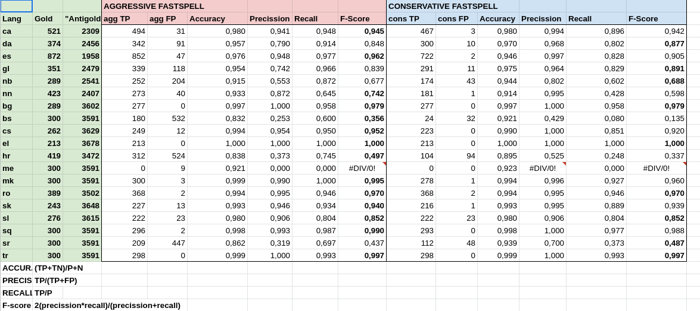

# FastSpell

Targetted language identifier, based on FastText and Hunspell.

## How it works 

FastSpell will try to determine the language of a sentence by using **[FastText](https://fasttext.cc/)**.

If the language detected is very similar to the target language (i.e. FastText detected Spanish, while the targetted language is Galician), extra checks are performed with **[Hunspell](http://hunspell.github.io/)** to determine the language more precisely.


## Requirements & Installation

**FastSpell** can be installed from PyPI
```
python3.7 -m pip install fastspell
```
or directly from source:
```
python3.7 setup.py install
```
Note that **Hunspell** requires `python-dev` and `libhunspell-dev`:

```
sudo apt-get install python-dev libhunspell-dev
``` 
Also note that Hunspell language packages must be installed by hand, i.e.:
```
sudo apt-get install hunspell-es
```
or downloaded from an external source, such as https://github.com/wooorm/dictionaries/tree/main/dictionaries 

You can also provide the path to the Hunspell dictionaries directories by using the dictpath atribute in `{/YOUR/INSTALLATION/PATH}/config/hunspell.yaml` (for example, `venv/lib/python3.7/site-packages/fastspell/config/hunspell.yaml` ) if you are installing from PyPI or with `setup.py`, or in `/config/hunspell.yaml` if you are running directly the code. Default path is `/usr/share/hunspell`.

### Configuration

A few configuration files are provided under the `/config` directory.

#### tokenizers.yaml

By default, `MosesTokenizer(lang)` is used. When there is no specific rules for `lang`, Moses Tokenizer falls back to  English. For some languages, we know that using other language is better (for example, using Spanish for Galician instead of English). Tokenizers for these languages can be customized in this file.

#### similar.yaml

In this dictionary-like file, similar languages are stored. These are the languages that are going to be "double-checked" with Hunspell after being identified with FastText. For example, see the line `gl: [es, pt, gl] `. This means that, when the targetted language is Galician, and FastText identifies a given sentence as Spanish, Portuguese or Galician, extra checks will be performed with Hunspell to confirm which of the three similar languages is more suitable for the sentence.

Please note that you need Hunspell dictionaries for all languages in this file. This file can be modified to remove a language you are not interested in, or a language for which you don't have Hunspell dictionaries, or to add new similar or target languages.

#### hunspell.yaml

In this file, both the path to Hunspell dictionary files  (default: `dictpath: /usr/share/hunspell/`) and the names of such dictionaries are stored. All similar languages must be in this list in order to properly work.

For example, the first entry in the `hunspell_codes` is ` ca: ca_ES`, and the dictionary path is `/usr/share/hunspell/`. That means that the Hunspell files for Catalan are  `/usr/share/hunspell/ca_ES.dic` and `/usr/share/hunspell/ca_ES.aff`.

## Usage

### Module:
In order to use **FastSpell** as a Python module, just install and import it :
```
from fastspell import FastSpell
```
Build a FastSpell object, like:
```
fsobj = FastSpell.FastSpell("en", mode="cons")
```
(learn more about modes in the section below)

And then use the `getlang` function with the sentences you want to identify, for example:
```
fsobj.getlang("Hello, world")
#'en'
fsobj.getlang("Hola, mundo")
#'es'

```

### CLI:
```
usage:  fastspell [-h] [--aggr] [--cons] [-q] [--debug] [--logfile LOGFILE]
                    [-v]
                    lang [input] [output]

positional arguments:
  lang
  input              Input sentences. (default: <_io.TextIOWrapper
                     name='<stdin>' encoding='UTF-8'>)
  output             Output of the language identification. (default:
                     <_io.TextIOWrapper name='<stdout>' mode='w'
                     encoding='UTF-8'>)

optional arguments:
  -h, --help         show this help message and exit
  --aggr             Aggressive strategy (more positives) (default: False)
  --cons             Conservative strategy (less positives) (default: False)

Logging:
  -q, --quiet        Silent logging mode (default: False)
  --debug            Debug logging mode (default: False)
  --logfile LOGFILE  Store log to a file (default: <_io.TextIOWrapper
                     name='<stderr>' mode='w' encoding='UTF-8'>)
  -v, --version      show version of this script and exit

```

## Aggressive vs Conservative

FastSpell comes in two flavours: Aggressive and Conservative.

The **Aggressive** mode is less hesitant to tag a sentence with the target language, and never has doubts. The **Conservative** version, on the other hand, is more reluctant to tag a sentence with the target language and will use the `unk`(unknown) tag in case of doubt (when there is a tie between the target language and other language, for example)

## Benchmark 




## Usage example

Input text:
```
19-01-2011 47 comentarios 7o Xornadas de Xardinería de Galicia (RE)PLANTEAR
• Proceso de valoración de idoneidade: entrevistas psicosociais e visita domiciliaria e aplicación de test psicolóxicos, se é o caso.
- Chrome e Firefox en MacOS non son compatibles (unicamente Safari é compatible con MacOS), pero invocarase PSAL ao intentar empregar Chrome ou Firefox.
Mago da luz / Maga da luz
Celebrada a homenaxe a Xosé Manuel Seivane Rivas
A instalación eléctrica en teletraballo
Saltar á navegación Navegación INICIO
Julio Freire, competidor da FGA, invitado polo Kennel club de Inglaterra, para participar nos Crufts 2014 (Birmingham, 6 - 9 de marzo).
25 de xullo - Truong Tan Sang toma posesión como presidente de Vietnam
Quen pode solicitar o dito financiamento?
```
Command:
```
python3.7 pyfastspell $L --aggr inputtext
python3.7 pyfastspell $L --cons inputtext
```
Aggressive output:
```
19-01-2011 47 comentarios 7o Xornadas de Xardinería de Galicia (RE)PLANTEAR     gl
• Proceso de valoración de idoneidade: entrevistas psicosociais e visita domiciliaria e aplicación de test psicolóxicos, se é o caso.   gl
- Chrome e Firefox en MacOS non son compatibles (unicamente Safari é compatible con MacOS), pero invocarase PSAL ao intentar empregar Chrome ou Firefox.        gl
Mago da luz / Maga da luz       gl
Celebrada a homenaxe a Xosé Manuel Seivane Rivas        gl
A instalación eléctrica en teletraballo gl
Saltar á navegación Navegación INICIO   gl
Julio Freire, competidor da FGA, invitado polo Kennel club de Inglaterra, para participar nos Crufts 2014 (Birmingham, 6 - 9 de marzo). es
25 de xullo - Truong Tan Sang toma posesión como presidente de Vietnam  gl
Quen pode solicitar o dito financiamento?       gl
```

Conservative output:
```
19-01-2011 47 comentarios 7o Xornadas de Xardinería de Galicia (RE)PLANTEAR     unk
• Proceso de valoración de idoneidade: entrevistas psicosociais e visita domiciliaria e aplicación de test psicolóxicos, se é o caso.   gl
- Chrome e Firefox en MacOS non son compatibles (unicamente Safari é compatible con MacOS), pero invocarase PSAL ao intentar empregar Chrome ou Firefox.        gl
Mago da luz / Maga da luz       unk
Celebrada a homenaxe a Xosé Manuel Seivane Rivas        gl
A instalación eléctrica en teletraballo unk
Saltar á navegación Navegación INICIO   gl
Julio Freire, competidor da FGA, invitado polo Kennel club de Inglaterra, para participar nos Crufts 2014 (Birmingham, 6 - 9 de marzo). es
25 de xullo - Truong Tan Sang toma posesión como presidente de Vietnam  gl
Quen pode solicitar o dito financiamento?       gl
```
Getting stats:
```
cat inputtext | python3.7 pyfastspell $L --aggr | cut -f2 | sort | uniq -c | sort -nr
cat inputtext | python3.7 pyfastspell $L --cons | cut -f2 | sort | uniq -c | sort -nr
```
Aggressive:
```
9 gl
1 es
```
Conservative:
```
6 gl
3 unk
1 es
```

